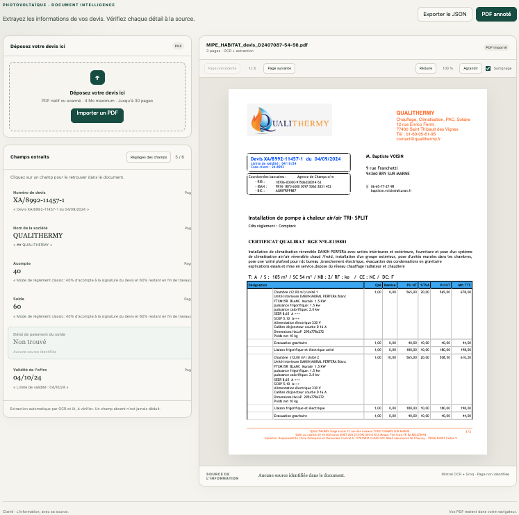
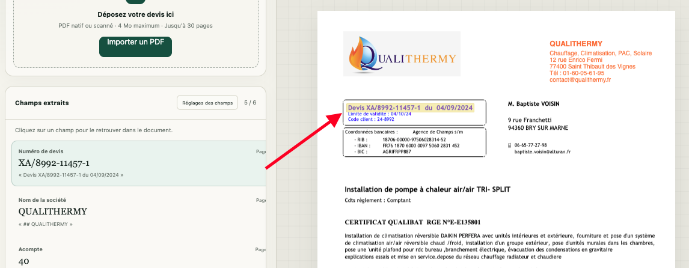
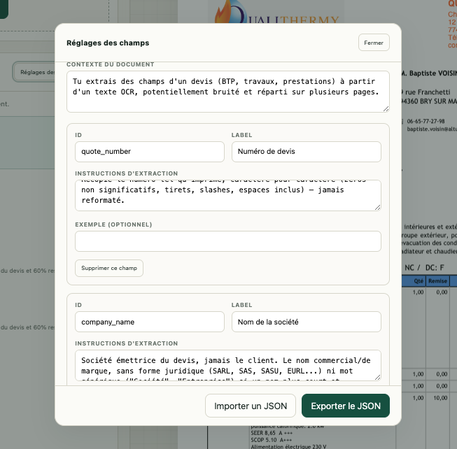

<div align="center">

# Devis Extraction PDF Linting

**Extrayez les champs clés de vos devis PDF — vérifiez chaque valeur à sa source, en un clic.**

[](LICENSE)
[](https://www.typescriptlang.org/)
[](https://vitejs.dev/)
[](https://nodejs.org/)

</div>

---

## Aperçu

Devis Extraction PDF Linting est une petite application web qui prend un devis
au format PDF (natif ou scanné), l'envoie à un pipeline OCR + LLM, et affiche
chaque champ extrait **avec sa preuve**, correspondant au passage exact du document dont
la valeur est issue, cliquable pour être retrouvé à la page et à la position
d'origine. Rien n'est jamais deviné silencieusement : un champ absent du
document reste vide plutôt que d'être déduit.

Les champs à extraire, leurs libellés et leurs règles d'extraction sont
pilotés par un simple fichier de configuration JSON (`config/fields.config.json`)
afin d'adapter l'outil à un autre type de document ne demande aucune modification
de code.

> 

### Extraction avec preuve à la source surlignée

> 

### Éditeur de champs

> 

## Fonctionnalités

- **Dépose de PDF** : natif ou scanné, jusqu'à 30 pages et 4 Mo, glisser-déposer ou sélection de fichier.
- **OCR + extraction par LLM** : texte extrait puis champs identifiés par un modèle de langage, avec repli automatique sur un fournisseur à quota plus large pour les documents volumineux.
- **Preuve à la source** : chaque valeur extraite pointe vers le passage exact du document (page + position) qui l'a produite.
- **Config des champs par JSON** : ajoutez, modifiez ou supprimez des champs à extraire sans toucher au code ; testez un override ponctuel sans redéployer.
- **Providers pluggables** : OCR (Mistral, Gemini, Cloudflare Workers AI, OpenRouter, Z.AI) et extraction (Groq, Gemini, Cloudflare Workers AI, OpenRouter, Z.AI), chacun remplaçable indépendamment.
- **Tracing optionnel** : intégration Langfuse (OpenTelemetry) pour observer les appels modèles en production ; désactivée par défaut, aucune configuration requise pour démarrer.
- **Export** : export JSON des champs extraits et impression d'un PDF annoté.

## Architecture

```
app/
├── src/              # Frontend Vite (upload PDF, rendu, éditeur de champs)
├── api/              # Fonction serverless Vercel (/api/extract, /api/health)
│   └── _lib/
│       ├── providers/
│       │   ├── ocr/          # Adaptateurs OCR (Mistral, Gemini, ...)
│       │   └── extraction/   # Adaptateurs d'extraction (Groq, Gemini, ...)
│       └── tracing/          # Tracer Langfuse optionnel (no-op par défaut)
└── config/
    ├── fields.config.json    # Champs à extraire (source de vérité)
    └── schema.ts             # Validation de la config
```

Le frontend envoie le PDF encodé en base64 à `/api/extract`, qui lance l'OCR
puis l'extraction et renvoie les champs avec leurs preuves. Voir
[choix_techniques.md](choix_techniques.md) pour le détail des décisions
techniques (config JSON des champs, tracing Langfuse).

## Démarrage rapide

Prérequis : Node.js ≥ 22.

```bash
cd app
npm install
cp .env.example .env   # puis renseigner au moins une clé OCR + une clé d'extraction
npm run dev
```

L'application est servie sur `http://localhost:5173` (Vite dev server ;
`vercel dev` peut être utilisé à la place pour tester la fonction serverless
localement dans les mêmes conditions que la prod).

### Configuration

Toutes les variables sont documentées dans [app/.env.example](app/.env.example) :

| Variable | Rôle | Défaut |
|---|---|---|
| `OCR_PROVIDER` | Fournisseur OCR (`mistral`, `gemini`, `cloudflare-workers-ai`, `openrouter`, `zai`) | `mistral` |
| `EXTRACTION_PROVIDER` | Fournisseur d'extraction | `groq` |
| `LARGE_DOC_EXTRACTION_PROVIDER` | Fournisseur utilisé au-delà d'~24 000 caractères de texte OCR | `gemini` |
| `MISTRAL_API_KEY` | Clé API Mistral (OCR) | — |
| `GROQ_API_KEY` | Clé API Groq (extraction) | — |
| `GEMINI_API_KEY` | Clé API Gemini (extraction des gros documents) | — |
| `VERCEL_TOKEN` | Token de déploiement (CLI `vercel` uniquement) | — |
| `LANGFUSE_PUBLIC_KEY` / `LANGFUSE_SECRET_KEY` | Tracing Langfuse (optionnel — absent = désactivé) | — |
| `LANGFUSE_BASE_URL` | Région Langfuse (vide = EU) | `https://cloud.langfuse.com` |

Seules les clés correspondant au provider OCR et au provider d'extraction
choisis sont nécessaires pour démarrer.

## Déploiement

L'application est prévue pour [Vercel](https://vercel.com) (frontend statique
+ fonction serverless) :

```bash
cd app
vercel deploy --prod
```

Configurez les variables d'environnement ci-dessus dans les paramètres du
projet Vercel (ou via `vercel env add`).

## Scripts disponibles

Depuis `app/` :

| Commande | Effet |
|---|---|
| `npm run dev` | Serveur de développement Vite |
| `npm run build` | Vérification des types (`tsc --noEmit`) puis build de production |
| `npm run preview` | Sert le build de production en local |
| `npm run typecheck` | Vérification des types seule |

## Licence

[MIT](LICENSE) © 2026 Youn Jehanno
